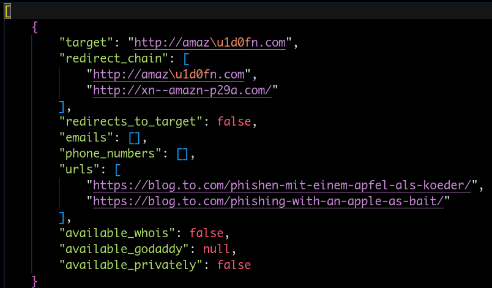

# AntiSquat

```
⠀⠀⠀⠀⠀⢀⣠⡤⢶⣾⠟⢻⡟⠻⣷⡶⢤⣄⡀⠀⠀⠀⠀⠀
⠀⠀⠀⣠⡶⠋⠁⢠⡟⠁⠀⢸⡇⠀⠈⢻⡄⠈⠙⢶⣄⠀⠀⠀
⠀⢀⡾⠛⠶⢦⣤⣟⣀⣀⣀⣸⣇⣀⣀⣀⣻⣤⡴⠶⠛⢷⡀⠀
⢠⡿⠀⠀⠀⠀⣾⠃⠉⠉⠉⢹⡏⠉⠉⠉⠘⣷⠀⠀⠀⠀⢿⡄
⣾⠃⠀⠀⠀⠀⣿⠀⠀⠀⠀⢸⡇⠀⠀⠀⠀⣿⠀⠀⠀⠀⠘⣷
⠿⠶⠶⠶⠶⠾⠿⠶⠶⠶⠶⠾⠷⠶⠶⠶⠶⠿⠷⠶⠶⠶⠶⠿
    A N T I  S Q U A T
by Owais Shaikh (@4f77616973) and Umair Nehri (@umair9747)
```

AntiSquat leverages AI techniques such as natural language processing (NLP), large language models (ChatGPT) and more to empower detection of typosquatting and phishing domains.

How to use
- Clone the project via `git clone https://github.com/redhuntlabs/antisquat`. 
- Install all dependencies by typing `pip install -r requirements.txt`.
- Get a ChatGPT API key at https://platform.openai.com/account/api-keys
- Create a file named `.openai-key` and paste your chatgpt api key in there.
- (Optional) Visit https://developer.godaddy.com/keys and grab a GoDaddy API key. Create a file named `.godaddy-key` and paste your godaddy api key in there.
- Create a file named ‘domains.txt’. Type in a line-separated list of domains you’d like to scan.
- (Optional) Create a file named `blacklist.txt`. Type in a line-separated list of domains you’d like to ignore. Regular expressions are supported.
- Run antisquat using `python3.8 antisquat.py domains.txt`

Examples:

Let’s say you’d like to run antisquat on "flipkart.com".

Create a file named "domains.txt", then type in `flipkart.com`. Then run `python3.8 antisquat.py domains.txt`.

AntiSquat generates several permutations of the domain, iterates through them one-by-one and tries extracting all contact information from the page.

Test case:

A test case for amazon.com is attached. To run it without any api keys, simply run `python3.8 test.py`



Here, the tool appears to have captured a test phishing site for amazon.com. Similar domains that may be available for sale can be captured in this way and any contact information from the site may be extracted.